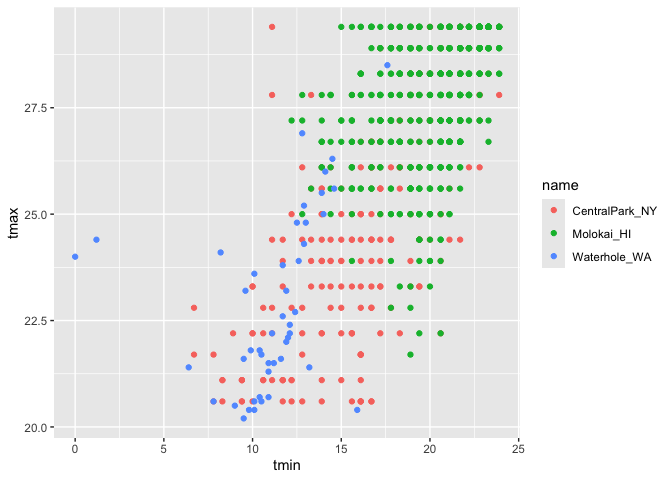

EDA
================
2024-10-03

``` r
library(tidyverse)
library(haven)
```

``` r
weather_df = 
  rnoaa::meteo_pull_monitors(
    c("USW00094728", "USW00022534", "USS0023B17S"),
    var = c("PRCP", "TMIN", "TMAX"), 
    date_min = "2021-01-01",
    date_max = "2022-12-31") |>
  mutate(
    name = case_match(
      id, 
      "USW00094728" ~ "CentralPark_NY", 
      "USW00022534" ~ "Molokai_HI",
      "USS0023B17S" ~ "Waterhole_WA"),
    tmin = tmin / 10,
    tmax = tmax / 10,
    month = lubridate::floor_date(date, unit = "month")) |>
  select(name, id, everything())
```

    ## using cached file: /Users/alicezhou/Library/Caches/org.R-project.R/R/rnoaa/noaa_ghcnd/USW00094728.dly

    ## date created (size, mb): 2024-09-26 10:17:55.5208 (8.651)

    ## file min/max dates: 1869-01-01 / 2024-09-30

    ## using cached file: /Users/alicezhou/Library/Caches/org.R-project.R/R/rnoaa/noaa_ghcnd/USW00022534.dly

    ## date created (size, mb): 2024-09-26 10:18:03.380233 (3.932)

    ## file min/max dates: 1949-10-01 / 2024-09-30

    ## using cached file: /Users/alicezhou/Library/Caches/org.R-project.R/R/rnoaa/noaa_ghcnd/USS0023B17S.dly

    ## date created (size, mb): 2024-09-26 10:18:05.997975 (1.036)

    ## file min/max dates: 1999-09-01 / 2024-09-30

``` r
weather_df %>% 
  ggplot(aes(x = prcp))+
  geom_histogram()
```

    ## `stat_bin()` using `bins = 30`. Pick better value with `binwidth`.

    ## Warning: Removed 15 rows containing non-finite outside the scale range
    ## (`stat_bin()`).

<!-- -->

``` r
weather_df |> 
  filter(prcp >= 1000)
```

    ## # A tibble: 3 × 7
    ##   name           id          date        prcp  tmax  tmin month     
    ##   <chr>          <chr>       <date>     <dbl> <dbl> <dbl> <date>    
    ## 1 CentralPark_NY USW00094728 2021-08-21  1130  27.8  22.8 2021-08-01
    ## 2 CentralPark_NY USW00094728 2021-09-01  1811  25.6  17.2 2021-09-01
    ## 3 Molokai_HI     USW00022534 2022-12-18  1120  23.3  18.9 2022-12-01

``` r
weather_df %>% 
  filter(tmax > 20, tmax < 30) %>% 
  ggplot(aes(x = tmin, y = tmax, color = name))+
  geom_point()
```

<!-- --> \## group_by()

``` r
weather_df %>% 
  group_by(name, month)
```

    ## # A tibble: 2,190 × 7
    ## # Groups:   name, month [72]
    ##    name           id          date        prcp  tmax  tmin month     
    ##    <chr>          <chr>       <date>     <dbl> <dbl> <dbl> <date>    
    ##  1 CentralPark_NY USW00094728 2021-01-01   157   4.4   0.6 2021-01-01
    ##  2 CentralPark_NY USW00094728 2021-01-02    13  10.6   2.2 2021-01-01
    ##  3 CentralPark_NY USW00094728 2021-01-03    56   3.3   1.1 2021-01-01
    ##  4 CentralPark_NY USW00094728 2021-01-04     5   6.1   1.7 2021-01-01
    ##  5 CentralPark_NY USW00094728 2021-01-05     0   5.6   2.2 2021-01-01
    ##  6 CentralPark_NY USW00094728 2021-01-06     0   5     1.1 2021-01-01
    ##  7 CentralPark_NY USW00094728 2021-01-07     0   5    -1   2021-01-01
    ##  8 CentralPark_NY USW00094728 2021-01-08     0   2.8  -2.7 2021-01-01
    ##  9 CentralPark_NY USW00094728 2021-01-09     0   2.8  -4.3 2021-01-01
    ## 10 CentralPark_NY USW00094728 2021-01-10     0   5    -1.6 2021-01-01
    ## # ℹ 2,180 more rows

counting stuff

``` r
weather_df %>% 
  group_by(name) %>%
  summarize(
    n_obs = n(),
    n_dist = n_distinct(month)
            )
```

    ## # A tibble: 3 × 3
    ##   name           n_obs n_dist
    ##   <chr>          <int>  <int>
    ## 1 CentralPark_NY   730     24
    ## 2 Molokai_HI       730     24
    ## 3 Waterhole_WA     730     24

``` r
weather_df %>% 
  count(name)
```

    ## # A tibble: 3 × 2
    ##   name               n
    ##   <chr>          <int>
    ## 1 CentralPark_NY   730
    ## 2 Molokai_HI       730
    ## 3 Waterhole_WA     730

summarize()

``` r
weather_df |>
  group_by(month) |>
  summarize(
    mean_tmax = mean(tmax, na.rm = TRUE),
    mean_prec = mean(prcp, na.rm = TRUE),
    median_tmax = median(tmax, na.rm = TRUE),
    sd_prcp = sd(prcp, na.rm = TRUE)
    ) 
```

    ## # A tibble: 24 × 5
    ##    month      mean_tmax mean_prec median_tmax sd_prcp
    ##    <date>         <dbl>     <dbl>       <dbl>   <dbl>
    ##  1 2021-01-01     10.9       39.5         5     113. 
    ##  2 2021-02-01      9.82      42.6         2.8    83.4
    ##  3 2021-03-01     13.7       55.5        12.5   107. 
    ##  4 2021-04-01     16.8       14.7        18.0    37.0
    ##  5 2021-05-01     19.6       17.3        22.2    48.1
    ##  6 2021-06-01     24.3       14.1        28.3    38.6
    ##  7 2021-07-01     25.2       30.7        28.3    96.6
    ##  8 2021-08-01     25.2       30.6        28.3   141. 
    ##  9 2021-09-01     22.4       35.4        24.4   200. 
    ## 10 2021-10-01     18.2       36.0        20.6   112. 
    ## # ℹ 14 more rows

lag() creates a copy and shift the entries down by 1

``` r
weather_df %>% 
  mutate(
    lagged_temp = lag(tmax),
    temp_change = tmax - lagged_temp
  ) %>% 
  filter(min_rank(temp_change) < 3)
```

    ## # A tibble: 2 × 9
    ##   name     id    date        prcp  tmax  tmin month      lagged_temp temp_change
    ##   <chr>    <chr> <date>     <dbl> <dbl> <dbl> <date>           <dbl>       <dbl>
    ## 1 Central… USW0… 2022-12-24     0  -9.3 -13.8 2022-12-01        14.4       -23.7
    ## 2 Waterho… USS0… 2021-01-01   254   3.2   0   2021-01-01        26.7       -23.5

## pulse data

``` r
pulse_df =
  read_sas("data/public_pulse_data.sas7bdat") %>% 
  janitor::clean_names() %>% 
  pivot_longer(
    bdi_score_bl:bdi_score_12m,
    names_to = "visit",
    values_to = "bdi_score",
    names_prefix = "bdi_score_"
  )
pulse_df %>% 
  group_by(visit) %>% 
  summarize(
    mean_bdi = mean(bdi_score, na.rm =TRUE)
  ) %>% 
  knitr::kable(digits = 1)
```

| visit | mean_bdi |
|:------|---------:|
| 01m   |      6.0 |
| 06m   |      5.7 |
| 12m   |      6.1 |
| bl    |      8.0 |
