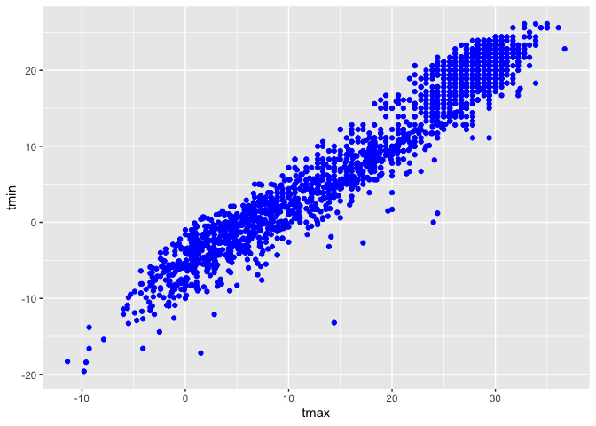

viz_and_eda
================
2024-09-26

``` r
library(tidyverse)
```

    ## ── Attaching core tidyverse packages ──────────────────────── tidyverse 2.0.0 ──
    ## ✔ dplyr     1.1.4     ✔ readr     2.1.5
    ## ✔ forcats   1.0.0     ✔ stringr   1.5.1
    ## ✔ ggplot2   3.5.1     ✔ tibble    3.2.1
    ## ✔ lubridate 1.9.3     ✔ tidyr     1.3.1
    ## ✔ purrr     1.0.2     
    ## ── Conflicts ────────────────────────────────────────── tidyverse_conflicts() ──
    ## ✖ dplyr::filter() masks stats::filter()
    ## ✖ dplyr::lag()    masks stats::lag()
    ## ℹ Use the conflicted package (<http://conflicted.r-lib.org/>) to force all conflicts to become errors

``` r
library(ggridges)
```

``` r
weather_df = 
  rnoaa::meteo_pull_monitors(
    c("USW00094728", "USW00022534", "USS0023B17S"),
    var = c("PRCP", "TMIN", "TMAX"), 
    date_min = "2021-01-01",
    date_max = "2022-12-31") |>
  mutate(
    name = case_match(
      id, 
      "USW00094728" ~ "CentralPark_NY", 
      "USW00022534" ~ "Molokai_HI",
      "USS0023B17S" ~ "Waterhole_WA"),
    tmin = tmin / 10,
    tmax = tmax / 10) |>
  select(name, id, everything())
```

    ## using cached file: /Users/alicezhou/Library/Caches/org.R-project.R/R/rnoaa/noaa_ghcnd/USW00094728.dly

    ## date created (size, mb): 2024-09-26 10:17:55.5208 (8.651)

    ## file min/max dates: 1869-01-01 / 2024-09-30

    ## using cached file: /Users/alicezhou/Library/Caches/org.R-project.R/R/rnoaa/noaa_ghcnd/USW00022534.dly

    ## date created (size, mb): 2024-09-26 10:18:03.380233 (3.932)

    ## file min/max dates: 1949-10-01 / 2024-09-30

    ## using cached file: /Users/alicezhou/Library/Caches/org.R-project.R/R/rnoaa/noaa_ghcnd/USS0023B17S.dly

    ## date created (size, mb): 2024-09-26 10:18:05.997975 (1.036)

    ## file min/max dates: 1999-09-01 / 2024-09-30

## Basic scatterplot

``` r
weather_df %>% 
  ggplot(aes(x = tmin, y = tmax)) +
  geom_point()
```

    ## Warning: Removed 17 rows containing missing values or values outside the scale range
    ## (`geom_point()`).

<!-- --> \##
advanced scatterplot

``` r
weather_df %>% 
  ggplot(aes(x = tmin, y = tmax, color = name)) +
  geom_point()
```

    ## Warning: Removed 17 rows containing missing values or values outside the scale range
    ## (`geom_point()`).

<!-- -->

``` r
weather_df %>% 
  ggplot(aes(x = tmin, y = tmax))+
  geom_point(aes(color = name), alpha = 0.5, size = 0.8) +
  geom_smooth(se = FALSE)
```

    ## `geom_smooth()` using method = 'gam' and formula = 'y ~ s(x, bs = "cs")'

    ## Warning: Removed 17 rows containing non-finite outside the scale range
    ## (`stat_smooth()`).

    ## Warning: Removed 17 rows containing missing values or values outside the scale range
    ## (`geom_point()`).

<!-- -->

``` r
weather_df %>% 
  ggplot(aes(x = tmin, y = tmax, color = name)) +
  geom_point(alpha = .3, size = .8) +
  geom_smooth(se = FALSE) +
  facet_grid(. ~ name)
```

    ## `geom_smooth()` using method = 'loess' and formula = 'y ~ x'

    ## Warning: Removed 17 rows containing non-finite outside the scale range
    ## (`stat_smooth()`).

    ## Warning: Removed 17 rows containing missing values or values outside the scale range
    ## (`geom_point()`).

<!-- -->

``` r
weather_df %>% 
  ggplot(aes(x = date, y = tmax, color = name, size = prcp))+
  geom_point(alpha = 0.3)+
  geom_smooth(se=FALSE)+
  facet_grid(.~name)
```

    ## Warning: Using `size` aesthetic for lines was deprecated in ggplot2 3.4.0.
    ## ℹ Please use `linewidth` instead.
    ## This warning is displayed once every 8 hours.
    ## Call `lifecycle::last_lifecycle_warnings()` to see where this warning was
    ## generated.

    ## `geom_smooth()` using method = 'loess' and formula = 'y ~ x'

    ## Warning: Removed 17 rows containing non-finite outside the scale range
    ## (`stat_smooth()`).

    ## Warning: The following aesthetics were dropped during statistical transformation: size.
    ## ℹ This can happen when ggplot fails to infer the correct grouping structure in
    ##   the data.
    ## ℹ Did you forget to specify a `group` aesthetic or to convert a numerical
    ##   variable into a factor?
    ## The following aesthetics were dropped during statistical transformation: size.
    ## ℹ This can happen when ggplot fails to infer the correct grouping structure in
    ##   the data.
    ## ℹ Did you forget to specify a `group` aesthetic or to convert a numerical
    ##   variable into a factor?
    ## The following aesthetics were dropped during statistical transformation: size.
    ## ℹ This can happen when ggplot fails to infer the correct grouping structure in
    ##   the data.
    ## ℹ Did you forget to specify a `group` aesthetic or to convert a numerical
    ##   variable into a factor?

    ## Warning: Removed 19 rows containing missing values or values outside the scale range
    ## (`geom_point()`).

<!-- -->

``` r
weather_df %>% 
  filter(name == "CentralPark_NY") %>% 
  mutate(
    tmax_f = tmax * (9/5) +32,
    tmin_f = tmin * (9/5) +32
  ) %>% 
  ggplot(aes(x = tmin_f , y = tmax_f))+
  geom_point()+
  geom_smooth(method = "lm", se = FALSE)
```

    ## `geom_smooth()` using formula = 'y ~ x'

<!-- --> \## odds
and ends

``` r
weather_df %>% 
  ggplot(aes(x = tmin, y = tmax))+
  geom_hex()
```

    ## Warning: Removed 17 rows containing non-finite outside the scale range
    ## (`stat_binhex()`).

<!-- -->

``` r
weather_df %>% 
  ggplot(aes(x = tmin, y = tmax))+
  geom_bin2d()
```

    ## Warning: Removed 17 rows containing non-finite outside the scale range
    ## (`stat_bin2d()`).

<!-- -->

``` r
weather_df %>% 
  ggplot(aes(x = tmin, y = tmax))+
  geom_density2d()
```

    ## Warning: Removed 17 rows containing non-finite outside the scale range
    ## (`stat_density2d()`).

<!-- -->
Learning Assessment: In the preceding, we set the alpha aesthetic “by
hand” instead of mapping it to a variable. This is possible for other
aesthetics too. To check your understanding of this point, try to
explain why the two lines below don’t produce the same result:

``` r
ggplot(weather_df) + geom_point(aes(x = tmax, y = tmin), color = "blue")
```

    ## Warning: Removed 17 rows containing missing values or values outside the scale range
    ## (`geom_point()`).

<!-- -->

``` r
ggplot(weather_df) + geom_point(aes(x = tmax, y = tmin, color = "blue"))
```

    ## Warning: Removed 17 rows containing missing values or values outside the scale range
    ## (`geom_point()`).

<!-- --> In the
first attempt, we’re defining the color of the points by hand; in the
second attempt, we’re implicitly creating a color variable that has the
value blue everywhere; ggplot is then assigning colors according to this
variable using the default color scheme.

## univariate plots

``` r
weather_df %>% 
  ggplot(aes(x = tmax))+
  geom_histogram(aes(fill = name), position = "dodge", binwidth = 1)
```

    ## Warning: Removed 17 rows containing non-finite outside the scale range
    ## (`stat_bin()`).

<!-- -->

``` r
weather_df %>% 
  ggplot(aes(x = tmax, fill = name))+
  geom_density(alpha = 0.5, adjust = 0.5)+
  geom_rug()
```

    ## Warning: Removed 17 rows containing non-finite outside the scale range
    ## (`stat_density()`).

<!-- -->

``` r
weather_df %>% 
  ggplot(aes(x = name, y = tmax))+
  geom_violin(aes(fill = name), alpha = 0.5) +
  stat_summary(fun = "median", color = "blue")
```

    ## Warning: Removed 17 rows containing non-finite outside the scale range
    ## (`stat_ydensity()`).

    ## Warning: Removed 17 rows containing non-finite outside the scale range
    ## (`stat_summary()`).

    ## Warning: Removed 3 rows containing missing values or values outside the scale range
    ## (`geom_segment()`).

<!-- -->

``` r
weather_df %>% 
  ggplot(aes(x = name, y = tmax))+
  geom_boxplot()
```

    ## Warning: Removed 17 rows containing non-finite outside the scale range
    ## (`stat_boxplot()`).

<!-- -->

``` r
weather_df %>% 
  ggplot(aes(x = tmax, y = name))+
  geom_density_ridges(scale = 0.85)
```

    ## Picking joint bandwidth of 1.54

    ## Warning: Removed 17 rows containing non-finite outside the scale range
    ## (`stat_density_ridges()`).

<!-- -->

LA: Make plots that compare precipitation across locations. Try a
histogram, a density plot, a boxplot, a violin plot, and a ridgeplot;
use aesthetic mappings to make your figure readable.

``` r
weather_df %>% 
  ggplot(aes(x = prcp, fill = name))+
  geom_density(alpha = 0.3)
```

    ## Warning: Removed 15 rows containing non-finite outside the scale range
    ## (`stat_density()`).

<!-- -->

``` r
weather_df %>% 
  ggplot(aes(x = prcp, fill = name))+
  geom_boxplot()
```

    ## Warning: Removed 15 rows containing non-finite outside the scale range
    ## (`stat_boxplot()`).

<!-- -->

``` r
weather_df %>% 
  filter(prcp>10, prcp<1000) %>% 
  ggplot(aes(x = prcp, fill = name))+
  geom_density(alpha = 0.3)
```

<!-- -->

``` r
weather_df %>% 
  filter(prcp>10, prcp<1000) %>% 
  ggplot(aes(x = prcp, y = name))+
  geom_density_ridges(scale = 0.85)
```

    ## Picking joint bandwidth of 30.7

<!-- -->

\##saving and embedding plots

``` r
weather_df %>% 
  filter(prcp>10, prcp<1000) %>% 
  ggplot(aes(x = prcp, y = name))+
  geom_density_ridges(scale = 0.85)
```

    ## Picking joint bandwidth of 30.7

<!-- -->

``` r
ggsave("plots/ggp_weather.pdf", width = 8, height = 6)
```

    ## Picking joint bandwidth of 30.7

``` r
knitr::opts_chunk$set(
  fig.width = 6,
  fig.asp = .6,
  out.width = "90%"
)
```
